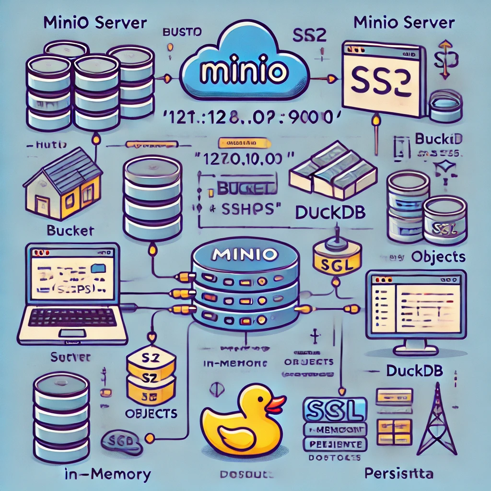

# **MinIO & DuckDB: Simplified Local Analytical Setup**

## **Introduction**

This project demonstrates a streamlined approach to building a local data analytics stack using **MinIO** for object storage and **DuckDB** for querying analytical datasets. The goal is to showcase how these open-source tools can provide an efficient, scalable, and cost-effective solution for analytical workloads.

### **Why MinIO and DuckDB?**
- **MinIO**: Offers a cloud-native, scalable object storage solution that can be implemented locally, simulating the flexibility of S3 on your machine.
- **DuckDB**: A powerful in-process SQL OLAP database with minimal setup that works seamlessly in both in-memory and persistent modes.

The simplicity and power of these tools make them ideal for experimentation and prototyping locally before scaling up.

## **Prerequisites**

### **System Requirements**
- **Operating System**: Windows 11 (macOS, or Linux)
- **Python Version**: >= 3.8

### **Required Tools**
1. **[MinIO](https://min.io)**: A local object storage solution
2. **[DuckDB](https://duckdb.org)**: A lightweight SQL analytics database
3. **[PyCharm Community Edition](https://www.jetbrains.com/pycharm/download/?section=windows)**: (or any Python IDE)

### **Dependencies**
Below are the python modules in my `requirements.txt` for this project:
```plaintext
minio >= 7.2.10
duckdb >= 1.1.3
boto3 >= 1.35.63
numpy >= 2.0.2
pandas >= 2.2.3
polars >= 1.13.1
```

## **Setup Instructions**

### **1. Installing MinIO and DuckDB**
- Download **[MinIO](https://dl.min.io/server/minio/release/windows-amd64/minio.exe)** and **[DuckDB](https://github.com/duckdb/duckdb/releases/download/v1.1.3/duckdb_cli-windows-amd64.zip)** executables from their respective websites.
- Add the executables' paths to your system environment variables for easier access.

### **2. Starting MinIO Server**
```bash
cd <path/to/minio/executable>
./minio server /path/to/storage --console-address :9001
```
- Log in to the MinIO Console at `http://localhost:9001` using:
  - Username: `minioadmin`
  - Password: `minioadmin`

### **3. Starting DuckDB**
```bash
cd <path/to/duckdb/executable>
./duckdb
```
This launches the DuckDB SQL client.

### **4. Features**
- **Local Object Storage**: Using MinIO as S3-compatible object storage solution.
- **Querying Efficiency**: DuckDB’s columnar storage ensures high-speed analytics.
- **Scalability**: Easily switch between in-memory and persistent modes for DuckDB.
- **Seamless Integration**: Perform analytical queries directly on MinIO-stored objects.

### 5. **Use Cases**
- **Local Data Exploration**: Analyze datasets without relying on cloud services.
- **Prototyping Analytics Pipelines**: Test workflows locally before scaling to cloud platforms.
- **Disaggregated Compute/Storage**: Separate storage (MinIO) and compute (DuckDB) layers to optimize resource usage.

## **Usage Guide**

### **Example Queries**
Here’s how you can interact with MinIO and DuckDB:
```python
from minio import Minio
import duckdb

# MinIO connection
client = Minio(f"localhost:9000", access_key=f"minioadmin", secret_key=f"minioadmin", secure=False)

# DuckDB connection
con = duckdb.connect(f":memory:")

# Example Query: Reading a CSV from MinIO into DuckDB
query = """
    SELECT * 
    FROM read_csv_auto('http://localhost:9000/bucket-name/file.csv', HEADER=True)
"""
df = con.execute(query).df()
print(df)
```

---

## **Architecture**
Here’s a high-level diagram illustrating the setup:




## **Challenges and Solutions**
- **Challenge**: Handling large datasets with limited memory.
  - **Solution**: Switch to DuckDB’s persisted mode and leverage MinIO for disaggregated storage.
- **Challenge**: Managing object storage paths dynamically.
  - **Solution**: Use Python automation to handle MinIO bucket operations.


## **Contribution Guidelines**
Feel free to fork this repository and open pull requests for:
- Enhancements to the stack.
- Additional use cases or scripts.


## **License**
This project is licensed under the MIT License. 
Acknowledgments to the teams behind [MinIO](https://min.io/docs/minio/linux/developers/python/API.html) and [DuckDB](https://duckdb.org/docs/sql/introduction).


## Next Steps:
1. **LakeHouse implementation**: To expand this setup to a local lakehouse platform, either through Hudi or Iceberg tables from MinIO base. And handle the computation side DuckDb
2. **MinIO feature exploration**: Some advanced MinIO features like versioning, replication, encryption, catalog, observability and so on. 


## Thank you!
